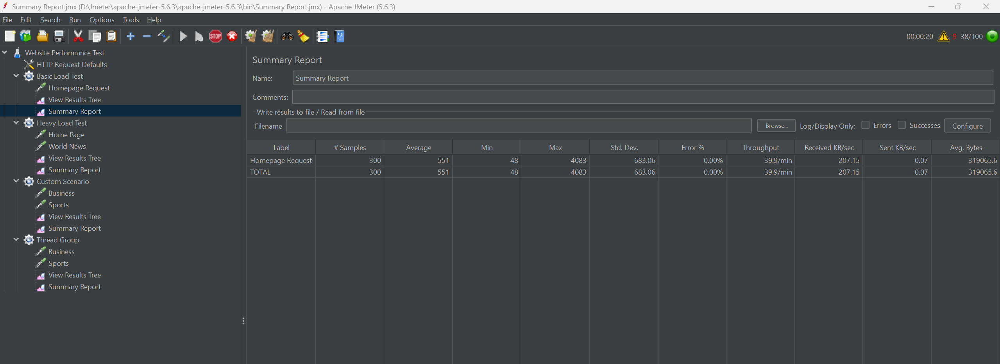
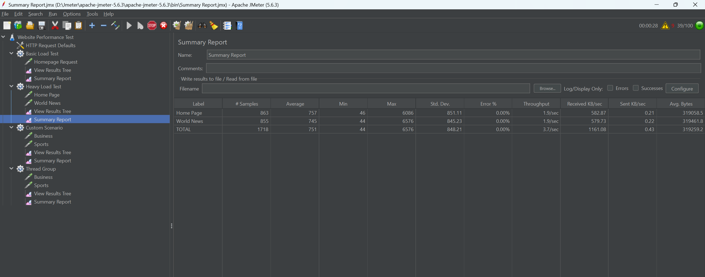
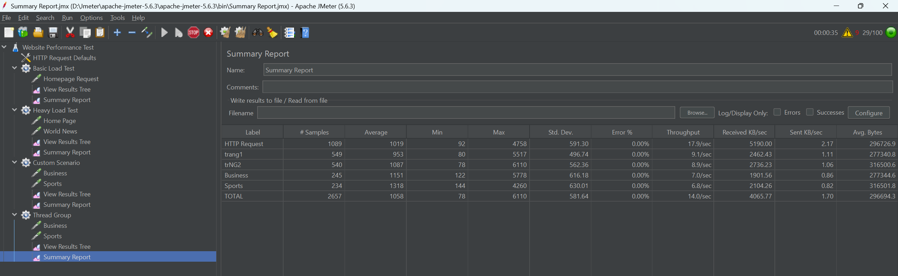

# JMeter Performance Test

## Website Tested

https://www.wikipedia.org

## Tool

Apache JMeter

---

# Test Scenario 1: Basic Load

Users: 10  
Loop Count: 5  

Action:
GET request to homepage

Result:

- Average Response Time: xxx ms
- Throughput: xxx/sec
- Error Rate: 0%

---

# Test Scenario 2: Heavy Load

Users: 50  
Ramp-up: 30 seconds  

Actions:
- GET homepage
- GET article page

Result:

- Average Response Time: xxx ms
- Throughput: xxx/sec
- Error Rate: x%

---

# Test Scenario 3: Custom Test

Users: 20  
Duration: 60 seconds  

Actions:

- GET /wiki/Artificial_intelligence
- GET /wiki/Computer_science

Result:

- Average Response Time: xxx ms
- Throughput: xxx/sec
- Error Rate: x%

---

# Conclusion

Website handled moderate traffic well. Response time increased when number of users increased.
